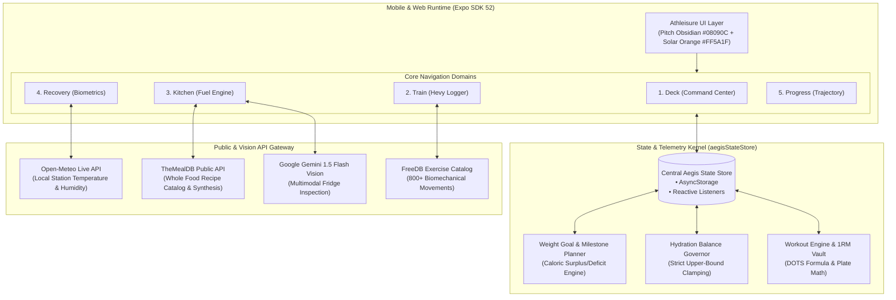

# IronForge

```
 ██╗██████╗  ██████╗ ███╗   ██╗███████╗ ██████╗ ██████╗  ██████╗ ███████╗
 ██║██╔══██╗██╔═══██╗████╗  ██║██╔════╝██╔═══██╗██╔══██╗██╔════╝ ██╔════╝
 ██║██████╔╝██║   ██║██╔██╗ ██║█████╗  ██║   ██║██████╔╝██║  ███╗█████╗  
 ██║██╔══██╗██║   ██║██║╚██╗██║██╔══╝  ██║   ██║██╔══██╗██║   ██║██╔══╝  
 ██║██║  ██║╚██████╔╝██║ ╚████║██║     ╚██████╔╝██║  ██║╚██████╔╝███████╗
 ╚═╝╚═╝  ╚═╝ ╚═════╝ ╚═╝  ╚═══╝╚═╝      ╚═════╝ ╚═╝  ╚═╝ ╚═════╝ ╚══════╝
```

> **Next-Generation Hypertrophy Telemetry, Vision Nutrition & Biomechanical Progression**  
> *Engineered with React Native (Expo SDK 52), NativeWind v4 (Tailwind CSS), and Athleisure Obsidian Aesthetics.*

---

[](https://reactnative.dev/)
[](https://expo.dev/)
[](https://www.nativewind.dev/)
[](https://www.typescriptlang.org/)
[](LICENSE)

---

## ⚡ Overview

**IronForge** is an elite strength, nutrition, and biological recovery workstation built for serious athletes and lifters. Designed with a custom **Athleisure Pitch Obsidian (`#08090C`)** and **Solar Orange (`#FF5A1F`)** palette, IronForge merges the precision of pro telemetry systems (Whoop, Hevy, MacroFactor) with zero AI bloat.

### Key Capabilities at a Glance:
* 🏋️ **Tactile Set-By-Set Lifting Engine**: Hevy-style execution cards with fixed-width column alignment, ghost previous-lift benchmarks, and an Olympic Barbell Plate Calculator.
* 📈 **8-Week SVG Progression Curves**: Mathematically synced body composition trajectories (Lean Bulk, Aggressive Bulk, Maintenance, Cut) with milestone dots, baseline guides, and DOTS powerlifting strength ratings.
* 🥗 **Dual-Engine Smart Kitchen**: Public recipe intelligence (TheMealDB API) + Google Gemini Vision fridge scanner for zero-friction macro logging.
* 🧬 **Whoop-Inspired Recovery Telemetry**: 0–100 autonomic readiness dials, sleep duration/quality logging, strictly capped cellular hydration with heat-stress buffers, and live atmospheric climate via Open-Meteo.
* 📅 **Interactive Training Calendar**: Real-time month grid with active date markers, day streaks, and rest day visualization.

---

## 📐 System Architecture & Data Flow



---

## 🖥️ Screen Layouts & ASCII Architectural Drawings

### 1. Training Card Set-By-Set Execution (`Train`)

The workout engine eliminates spreadsheet clutter with a structured column header and precise numeric inputs. The plate calculator is built into the card header.

```
┌────────────────────────────────────────────────────────────────────────┐
│ 🏋️ BARBELL BENCH PRESS                     [◎ PLATES]   [PR 100 KG]   │
│ Sternal Pectoralis Major • Compound                                    │
├────────────────────────────────────────────────────────────────────────┤
│ 3 Sets × 6–10 Reps • RPE 8.5 • 90s Rest                       1/3 DONE │
├───────────┬──────────────┬─────────────┬─────────────┬─────────────────┤
│    SET    │   PREVIOUS   │     KG      │    REPS     │        ✓        │
├───────────┼──────────────┼─────────────┼─────────────┼─────────────────┤
│    [1]    │   60k × 8    │   [ 60 ]    │    [ 8 ]    │     (  ✓  )     │
│    [2]    │   60k × 8    │   [ 60 ]    │    [ 8 ]    │     (     )     │
│    [3]    │   60k × 8    │   [ 60 ]    │    [ 8 ]    │     (     )     │
├───────────┴──────────────┴─────────────┴─────────────┴─────────────────┤
│                               + ADD SET                                │
└────────────────────────────────────────────────────────────────────────┘
```

#### Olympic Barbell Plate Calculator Breakdown
Clicking `Plates` resolves exact plate loads for standard 20 kg (or 45 lb) bars:

```
[ 60 KG TARGET ] ──► (60 - 20) / 2 = 20 KG PER SIDE
  ├── 1 × 20 kg  [ Blue Ring ]
  └── Barbell Collar Clamped
```

---

### 2. Concentric Macro Rings (`Deck`)

Visualizes daily energy and macronutrient expenditure with nested SVG circular arcs:

```
                  ┌───────────────────────────────┐
                  │        ╭─────────────╮        │
                  │      ╭─── 2,420 kcal ───╮     │  ◄── Outer: Total Calories
                  │    ╭─   PROTEIN: 165g   ─╮    │  ◄── Middle: Protein Target
                  │   │  ╭─  CARBS: 260g  ─╮  │   │  ◄── Inner: Complex Carbs
                  │   │ │ ╭─ FATS: 65g ─╮ │ │  │  │  ◄── Core: Healthy Fats
                  │   │ │ │   78% FUEL  │ │ │  │  │
                  │   │ │ ╰─────────────╯ │ │  │  │
                  │   │  ╰────────────────╯  │   │
                  │    ╰─────────────────────╯    │
                  │        ╰─────────────╯        │
                  └───────────────────────────────┘
```

---

### 3. Dynamic 8-Week Progression Curve (`Progress`)

Calculates target weekly delta according to active user phase (Bulk vs Cut). Features SVG linear gradient area fill, milestone week markers, baseline and target guides, and actual weigh-in tracking:

```
  KG ┌──────────────────────────────────────────────────────────────────┐
82.0 │                                                      ● W8 (81.4k)│
81.4 │ - - - - - - - - - - - - - - - - - - - - - - - - - - / (Target)   │
80.8 │                                            ●-------/             │
80.2 │                                 ●---------/                      │
79.8 │               ● (Actual Check-In)                                │
79.6 │           ●--/                                                   │
79.0 │ ● W0 - - - - - - - - - - - - - - - - - - - - - - - - (Baseline)  │
     └─┬─────────┬─────────┬─────────┬─────────┬─────────┬─────────┬────┘
       W0        W1        W2        W3        W4        W6        W8   
       
  LEAN BULK (+0.3 kg/wk) • TARGET VELOCITY: +1.2 kg/mo • 15 WEEKS TO TARGET
```

---

### 4. Recovery & Cellular Hydration Balance (`Recovery`)

Autonomic readiness with strict hydration cap enforcement (prevents water intoxication, caps strictly to user's daily maximum):

```
┌────────────────────────────────────────────────────────────────────────┐
│ ⚡ WHOOP RECOVERY SCORE                       [ 🌙 7.5h SLEEP LOGGED ]  │
│                         ╭─────────────╮                                │
│                        │     88%      │                                │
│                         ╰─────────────╯                                │
│                  OPTIMAL RECOVERY FOR STRAIN                           │
├────────────────────────────────────────────────────────────────────────┤
│ 💧 HYDRATION BALANCE                                  ✓ TARGET REACHED │
│                             3.30L                                      │
│                 Daily Target Cap: 3.3L Max                             │
│                 (Includes +500ml Local Heat Buffer)                    │
│ [====================================================] 100%            │
│                                                                        │
│   [ + 250ml ]        [ + 500ml ]        [ + 1L ]        [ ⟳ RESET ]    │
└────────────────────────────────────────────────────────────────────────┘
```

---

## 🎨 Athleisure Design System & Color Tokens

IronForge follows a clean, single-surface dark aesthetic inspired by modern performance gear:

| Token Name | Hex Code | Purpose |
|:---|:---|:---|
| **Pitch Obsidian** | `#08090C` | Root app background, status bar, and deep container base |
| **Liquid Carbon** | `#12131A` | Primary card surfaces (single-layer hierarchy, zero nested boxes) |
| **Elevated Surface**| `#181922` | Sub-elements, set inputs, pill buttons, and modals |
| **Solar Orange** | `#FF5A1F` | Primary interactive brand accent, active state, and bulk velocity |
| **Vitality Cyan** | `#38BDF8` | Cellular hydration, body fat %, and water progress bar |
| **Recovery Emerald**| `#10B981` | Completed sets (✓), optimal recovery scores, cutting phase delta |
| **Muted Ash** | `#71717A` | Labels, ghost previous values, secondary metadata |
| **Ghost White** | `#FFFFFF` | Primary numeric readouts, typography headers |

---

## 📂 Project Structure

```
IronForge/
├── app/
│   ├── (tabs)/
│   │   ├── _layout.tsx           # Custom Athleisure Tab Bar with haptic triggers
│   │   ├── index.tsx             # 1. Deck: Concentric rings, calendar, strain summary
│   │   ├── workout.tsx           # 2. Train: Set logging, column alignment, plates modal
│   │   ├── pantry.tsx            # 3. Kitchen: Public recipe search, vision AI scanner
│   │   ├── recovery.tsx          # 4. Recovery: Whoop dial, sleep, capped hydration
│   │   └── trajectory.tsx        # 5. Progress: 8-Week SVG curve, goal planner, 1RM vault
│   ├── _layout.tsx               # Root layout, Safe Area Provider, web dark mode flag
│   └── onboarding.tsx            # Multi-step athletic profile setup (goal, sex, split)
├── components/
│   ├── ui/
│   │   ├── CalendarTracker.tsx   # Interactive Monthly Training Calendar
│   │   ├── ConcentricMacroRings.tsx # Multi-tier SVG Nutrition Donut
│   │   ├── CircularDial.tsx      # SVG Autonomic Recovery Arc
│   │   ├── PhotoCard.tsx         # Minimalist Athleisure Hero Cards
│   │   ├── WeightGoalPlanner.tsx # Dynamic Calorie/Pace Milestone Calculator
│   │   └── SmoothPressable.tsx   # Micro-interaction pressable with scale animations
│   ├── PlateCalculatorModal.tsx  # Olympic barbell plate loading assistant
│   └── AegisConfigModal.tsx      # Telemetry & profile parameters modal
├── services/
│   ├── aegisStateStore.ts        # Core single-source-of-truth state manager
│   ├── publicApis.ts             # Open-Meteo & TheMealDB public endpoints
│   ├── fridgeVision.ts           # Gemini 1.5 Flash fridge scanning service
│   └── userMetrics.ts            # DOTS score, 1RM formulas, caloric equations
├── data/
│   ├── workoutCatalog.ts         # FreeDB 800+ exercise index & categorizations
│   └── muscleRoutines.ts         # Anatomical muscle groups & recovery periods
├── assets/
│   └── generated/                # Hero imagery for tabs (train, kitchen, recovery, progress)
├── tailwind.config.js            # NativeWind v4 configuration with darkMode: 'class'
├── global.css                    # Tailwind CSS directives & root interop CSS variables
└── package.json                  # Dependencies & scripts
```

---

## 🚀 Getting Started

### Prerequisites
* **Node.js**: v18.0.0 or higher
* **npm** or **yarn**
* **Expo Go** (Android/iOS) or modern browser for web preview

### 1. Installation
Clone the repository and install all dependencies:
```bash
git clone https://github.com/your-username/IronForge.git
cd IronForge
npm install
```

### 2. Environment Variables
Create a `.env` file in the project root:
```env
# Optional: Google Gemini Vision API for Fridge Scanning
EXPO_PUBLIC_GEMINI_API_KEY=your_gemini_api_key_here
```
*(Note: Core workout tracking, plate math, TheMealDB recipe database, and Open-Meteo climate telemetry work out-of-the-box without requiring API keys!)*

### 3. Running the App
* **Start Metro Development Server**:
  ```bash
  npx expo start -c
  ```
* **Run on Web**:
  ```bash
  npx expo start --web
  ```
* **Run on Android / iOS**:
  Scan the QR code printed in the terminal using the Expo Go mobile app.

---

## 🧪 Verification & Build Commands

```bash
# Verify TypeScript type-safety
npx tsc --noEmit

# Export static production web bundle
npx expo export -p web

# Serve production web build locally
npx serve dist -l 3000
```

---

## 📄 License
This project is licensed under the MIT License — see the [LICENSE](LICENSE) file for details.
